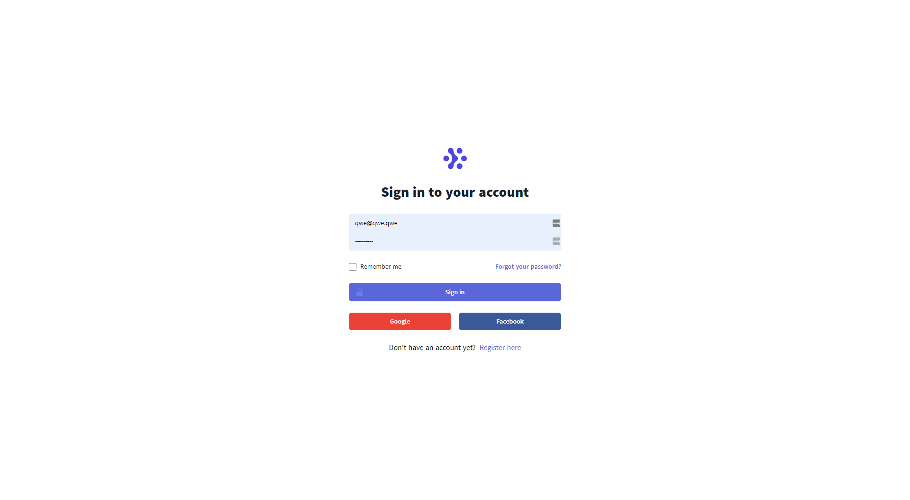
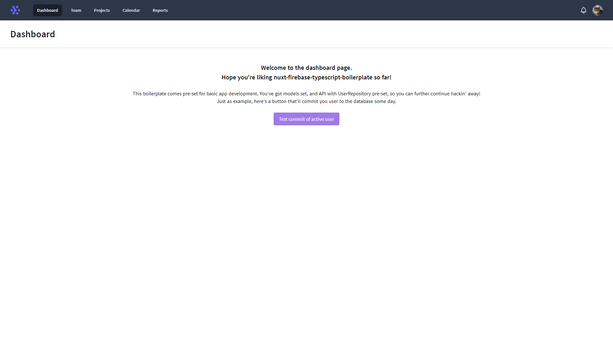
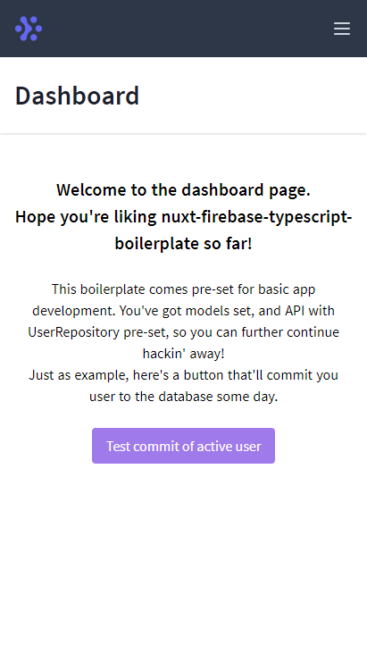

# Project Name
> A quick boilerplate to kick-start your next Nuxt/Firebase auth project

## Table of contents
* [General info](#general-info)
* [Screenshots](#screenshots)
* [Technologies](#technologies)
* [Setup](#setup)
* [Features](#features)
* [Status](#status)
* [Contact](#contact)

## General info
// TODO:: write general info. :)

## Screenshots





## Technologies
```
  "dependencies": {
    "@nuxt/typescript-runtime": "^2.0.1",
    "@nuxtjs/axios": "^5.12.5",
    "@nuxtjs/firebase": "^7.4.1",
    "core-js": "^3.8.2",
    "firebase": "^8.2.4",
    "nuxt": "^2.14.12",
    "siiimple-toast": "^3.1.7"
  },
  "devDependencies": {
    "@nuxt/types": "^2.14.12",
    "@nuxt/typescript-build": "^2.0.4",
    "@nuxtjs/dotenv": "^1.4.1",
    "@nuxtjs/eslint-config-typescript": "^5.0.0",
    "@nuxtjs/eslint-module": "^3.0.2",
    "@nuxtjs/router-extras": "^1.1.1",
    "@nuxtjs/tailwindcss": "^3.4.2",
    "babel-eslint": "^10.1.0",
    "eslint": "^7.18.0",
    "eslint-plugin-nuxt": "^2.0.0",
    "eslint-plugin-vue": "^7.4.1"
  },
```

## Setup
Install process is pretty straightforward.

```
git clone https://github.com/VPetar/nuxt-firebase-typescript-boilerplate.git
cd nuxt-firebase-typescript-boilerplate
yarn install
yarn dev
```

## Features
List of features ready and TODOs for future development
* Login with Firebase
* Setup User model and basic API setup
* Setup toast messaging system for notifications
* Basic middleware
* PWA / SSR / Cool stuff

To-do list:
* Working on todos... :)

## Status
Project is: _in progress_


## Contact
Created by [@PetarVukmanovic](https://twitter.com/PetarVukmanovic) - feel free to contact me!